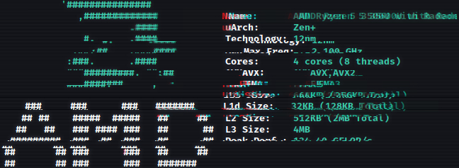

# Hello There!

I recently start to program and learning complex things (this is more hard that I thought but I will NEVER give up about my desires: to be a good programmer!

## More About Me

- 🧮 Focused Every Day (I also like math, but I don't know so much... 🥲)
- 🥚 19 y.o.
- 🇧🇷 Native Language (Brazilian Portuguese)
- 🇺🇸 My Second Language (English: I still learning yet...)
- 🌱 I’m Interested in Emulators; Reverse engineering; Hacking; Graphics and others
- 💻 My Laptop: Ryzen 5 3500U + Vega 8 (S145)
- 🐧 Linux User: Kali Linux 2022 & Manjaro
- 🪟 Windows User: 11 Edition Home

### CPU Configuration (cpufetch)

### Social Networks

## Miscs

**Bytes are bytes, and a lot of bits too!**

~~~bash
cat main.c
~~~
~~~c
#include <stdio.h>
typedef unsigned short U16;
int main()
{
  _Alignas(8) U16 message_array[] = {
    0x654b, 0x7065, 0x6920, 0x2074, 0x6f43, 
    0x706d, 0x656c, 0x2c78, 0x5320, 0x7574,
    0x6970, 0x2164, 0x2d20, 0x6220, 0x2079,
    0x6147, 0x7262, 0x6569, 0x206c, 0x6f43,
    0x7272, 0x6965, 0x2161, 0x000a
  };
  printf("%s", (char*)message_array);
}
~~~
~~~bash
make main
./main
Keep it Complex, Stupid! - by Gabriel Correia!

~~~
