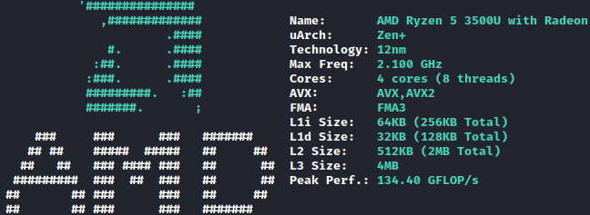

# Hello There!

I recently start to program and learning complex things (this is more hard that I thought but I will NEVER give up about my desires: to be a good programmer!

## More about me

- 🧮 Focused every day (I also like math, but I don't know so much... 🥲)
- 🥚 19 y.o.
- 🇧🇷 Native language (Brazilian Portuguese)
- 🇺🇸 My second language (English: I still learning yet...)
- 🌱 I’m interested in Emulators; Reverse engineering; Hacking; Graphics and others
- 💻 My setup: Ryzen 5 3500U + Vega 8 (Laptop S145)
- 🐧 Linux user (Actually Kali Linux / Manjaro)
- 🪟 Windows user (Windows 11)

### CPU configuration (cpufetch)

### Social Networks

## Miscs

**Bytes are bytes, and a lot of bits too!**

~~~bash
cat main.c
~~~
~~~c
#include <stdio.h>
typedef unsigned char U8;
int main()
{
  _Alignas(16) U8 welcome_array[] = {
    0x48, 0x65, 0x6c, 0x6c, 0x6f, 0x20, 0x74, 
    0x68, 0x65, 0x72, 0x65, 0x21, 0x20, 0x49, 
    0x27, 0x6d, 0x20, 0x47, 0x61, 0x62, 0x72, 
    0x69, 0x65, 0x6c, 0x20, 0x43, 0x6f, 0x72,
    0x72, 0x65, 0x69, 0x61, 0x21, 0x0a, 0x00
  };

  printf("%s", (char*)welcome_array);
}
~~~
~~~bash
make main
./main
Hello there! I'm Gabriel Correia!

~~~
